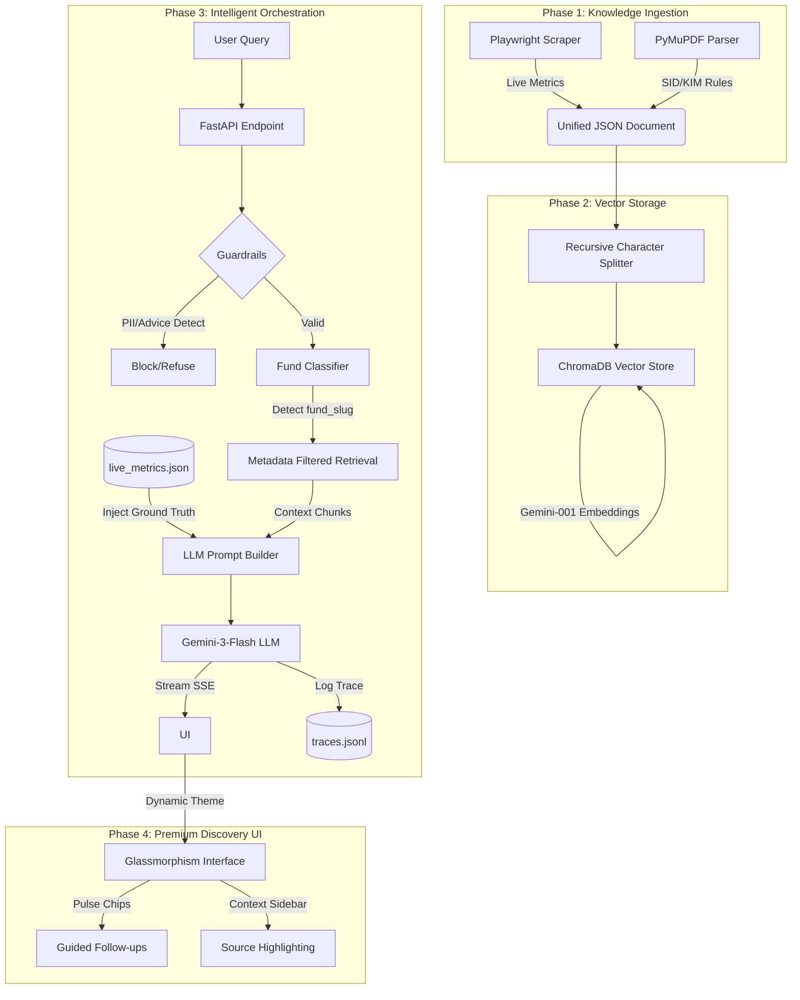

# 🏗️ Architecture Overview

This document outlines the high-fidelity technical architecture of the **Groww AI Fact Engine**, a RAG system optimized for financial data accuracy, regulatory compliance, and real-time data freshness.

## 🗺️ High-Level Technical Flow

---

## 🔧 Component Breakdown

### 1. The Ingestion Engine (`phase1_ingestion`)
*   **Dynamic Scraping**: Uses `Playwright` to navigate the Groww SPA (Single Page Application) and extract highly volatile metrics (NAV, Fund Size, Expense Ratio).
*   **Static Extraction**: Uses `PyMuPDF` to parse official Scheme Information Documents (SIDs).
*   **Unified Schema**: Both sources are unified into a strict JSON schema, ensuring that the RAG engine has a consistent view of each fund.

### 2. The Hybrid Vector Store (`phase2_rag`)
*   **Metadata Filtering (Namespace Pattern)**: To eliminate "Fund Mixing" (where the bot answers for the wrong fund), every chunk is tagged with a `fund_slug`. The retriever uses these tags to restrict search results to the relevant fund.
*   **Embeddings**: Powered by Google’s `models/gemini-embedding-001` for high-dimensional semantic search.

### 3. The Orchestration Layer (`phase3_api`)
This is the "Brain" of the system, implementing three critical patterns:
*   **Live Metrics Injection**: Volatile data (NAV) is injected directly into the LLM system prompt from a local `live_metrics.json` file. This bypasses vector search for time-sensitive data, ensuring 100% accuracy without re-indexing.
*   **Multi-Stage Guardrails**: 
    *   *Input*: Regex-based PII blocking (PAN/Aadhaar) and Scope Gate keywords.
    *   *System*: Strict "No Investment Advice" instructions.
    *   *Output*: Tag-based parsing to separate the factual answer from follow-up metadata.
*   **Observability (Traces)**: Every user interaction is logged to `traces.jsonl` with full retrieval context, enabling offline debugging and evaluation.

### 4. The Discovery UI (`frontend`)
Built with **Next.js 14** and **TailwindCSS**, the UI is designed to build user trust:
*   **Glassmorphism Aesthetic**: High-end "frosted glass" containers with fund-aware dynamic theming (e.g., Orange for Hybrid, Purple for ELSS).
*   **Source Highlighting**: The left sidebar dynamically highlights the specific documents used to generate the current response.
*   **Interactive Pulse Chips**: LLM-generated follow-up questions pulse gently to guide the user's discovery path.

---

## 🔒 Security & Compliance
*   **PII Sanitization**: Automatic 400 Bad Request if Indian tax/social identifiers are detected.
*   **Zero-Advisory Logic**: Hard-refusal of opinionated queries (e.g., "should I buy?").
*   **Grounding Enforcement**: System prompt mandates that if a fact isn't in the provided context, the bot must admit it doesn't know.
