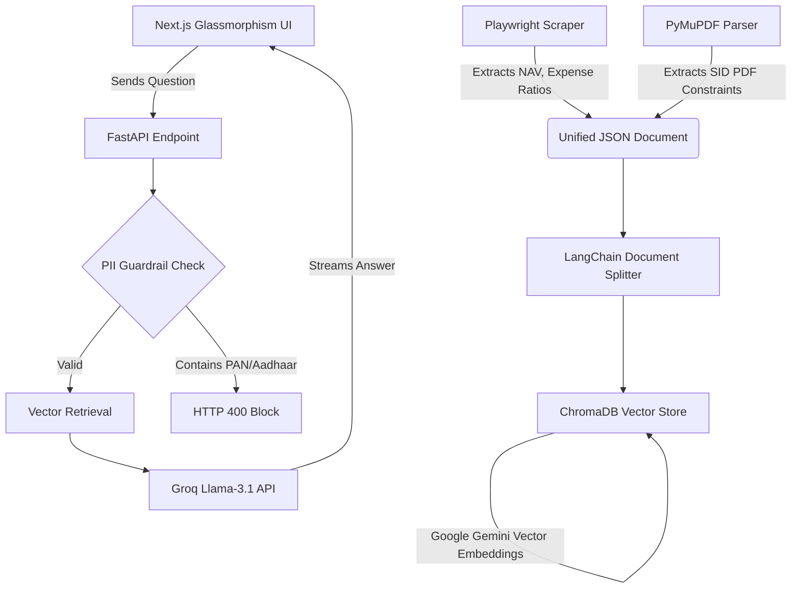

# Architecture Overview

This document outlines the technical flow of the Groww AI Fact Engine. 

## High-Level Diagram

## Component Breakdown

### 1. The Ingestion Engine (`phase1_ingestion`)
Because Groww is a modern React/Next.js Single Page Application, standard `requests` libraries cannot see the DOM. We use `Playwright` acting as a headless browser to mount the DOM and extract the metric nodes. We use `PyMuPDF` to parse the highly-structured tables inside the Scheme Information Documents (SIDs).

### 2. The Vector Database (`phase2_rag`)
We use `ChromaDB` for lightweight, on-disk storage inside `chroma_db/`. We use Google's Generative AI `gemini-embedding-001` model to create the vector embeddings instead of OpenAI or heavy local HuggingFace transformers. 

**Hybrid Prioritization**: The retriever is explicitly built with LangChain to prioritize Web document chunks when the query relates to rapidly-changing metrics (NAV, Fund Size), and PDF document chunks when the query relates to static rules (Exit Loads, Constraints).

### 3. The Backend (`phase3_api`)
We use `FastAPI` configured to `0.0.0.0` and listening on the dynamic `$PORT` environment variable to ensure Render health-check compatibilities. 

**Guided Response Orchestration**: 
The API performs a single-pass LLM call using a "3-in-1" prompt strategy. The LLM is instructed to return response data wrapped in structural tags (`[ANSWER]`, `[SOURCE_SUMMARIES]`, `[NEXT_STEPS]`).
* **Tag-Based Parsing**: The backend implements an incremental state-machine parser that streams the answer content to the user immediately while buffering the metadata (summaries and follow-ups) to be sent as a structured JSON object at the end of the stream.
* **Guardrails (`guardrails.py`)**: Enforces regex checks for standard Indian Tax Identifiers (PAN) and Social Identifiers (Aadhaar), and injects a strict System Prompt designed for beginner-friendly discovery.

### 4. The Frontend (`frontend` directory)
We use `Next.js 14` with App Router. The `page.tsx` client component uses `TextDecoder` to parse the Server-Sent Event (SSE) stream returned by FastAPI in real-time. 
* **Dynamic Discovery**: The UI replaces static chips with dynamic follow-up questions generated by the LLM based on the current context.
* **Rich Citations**: Citation cards now display LLM-generated summaries explaining *why* a specific document is relevant to the answer, providing better transparency for beginner investors.
* **Glassmorphism UI**: The UI utilizes custom `--glass-bg` TailwindCSS variables for a premium Fintech aesthetic.
