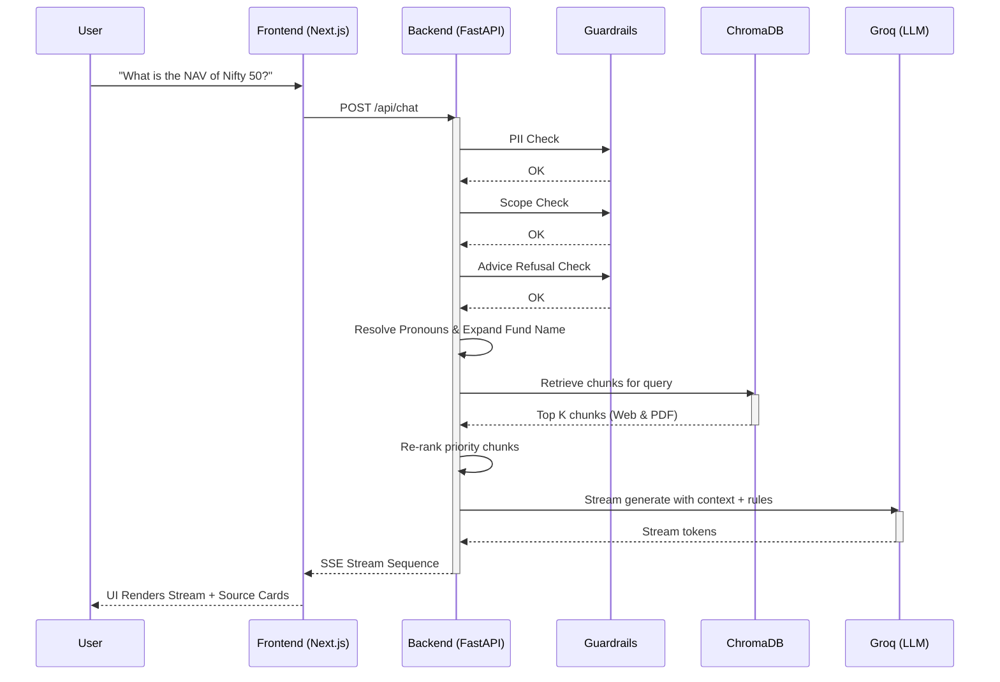

# Architecture Overview

The Groww AI Fact Engine follows a microservice architecture with a separated frontend and backend. The backend manages the RAG pipeline, taking queries, searching the vector database, and streaming LLM responses.

## System Diagram

## Component Summary

1. **Frontend**: Manages user input, chat history UI, Server-Sent Events parsing, and source card rendering. 
2. **Backend**: Validates queries, maintains conversation memory, controls context extraction, and manages generation.
3. **Database**: Persistent local ChromaDB containing 1644 chunks from 4 mutual funds. Embeddings are generated ahead of time using Google Gemini capabilities.
